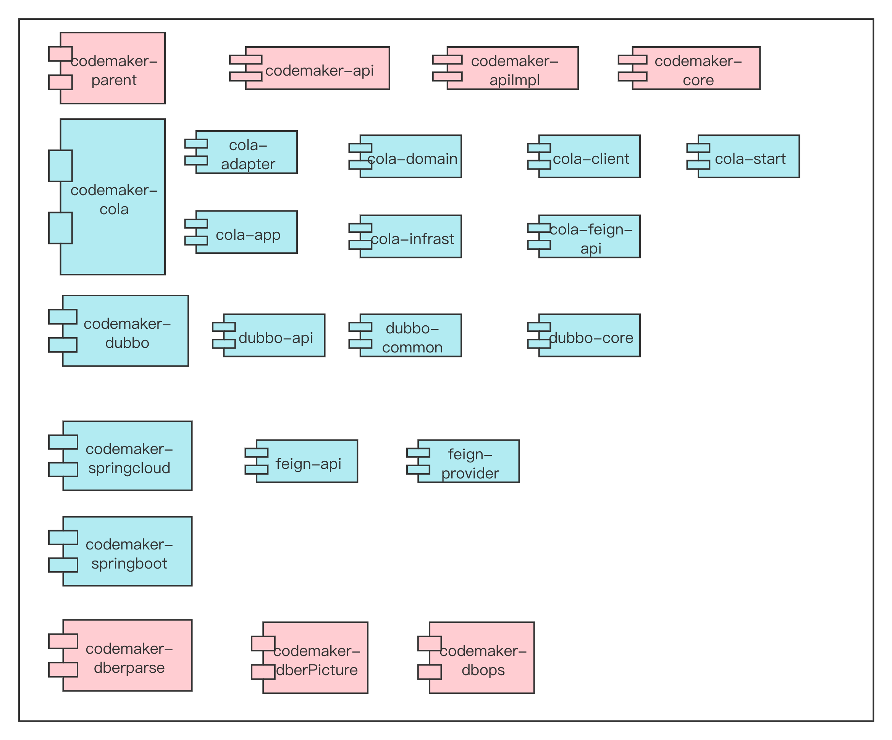

#天画-codeMaker

#### 介绍
为大规模微服务构建而创建的代码生成工具,属于天画项目中的基础产品
天画项目链接：https://gitee.com/sky-painting
coderMaker 立足于低代码平台，致力于解决软件开发过程中的效率问题
1. 不依赖任何代码生成工具
2. 本身基于mysql + mybatis + spring boot生成项目增删改查等功能
3. 项目工具目前主要是为了构建可复用的代码生成服务
4. 总体目标是为构建大规模分布式应用的技术底座，提高开发效率，专注业务领域，数据模型。
5. 为高并发,分布式,大数据等场景提供业务应用代码支持,辅助学习者方便快捷构建大量分布式微服务应用。
6. 支持多框架应用+动态ddd+动态调用方法绘制的Java代码生成平台

#### 设计理念
1. 所建即所得，文档即代码
2. 数据库模型与领域模型同步支持
3. 不做任何脚手架,不依赖任何特定框架版本
4. 按开发者习惯支持多模式生成
5. 兼容并蓄,在codemaker的组件化架构设计中一切业务组件，中间件，脚手架都是组件都是可配置可融入到代码生成流程的。
6. 生成即可运行

#### 功能列表
1. 提供数据库字段文本转sql脚本的能力
2. 提供便捷的sql脚本(支持分库分表)生成服务，帮助初始化数据库
3. 提供一键式的数据库e-r图生成服务，以及从plantUML-er图中解析还原到sql脚本的能力
4. 提供基于springboot,cola,dubbo应用框架和架构下的应用级代码生成服务
5. 提供基于plantuml类图的dynamic-ddd模块级的代码生成服务
6. 支持基于数据库表的代码生成和支持plantuml领域文档的代码生成服务
7. 支持基于数据库表+DDD+plantUML类图文档+plantUML调用时序文档的代码生成服务
8. 支持可适配可拔插的组件化模块化代码生成

#### 软件架构
##### 1. 工程模块架构

1. 粉红色为codeMaker提供的平台能力工程
2. 浅蓝色为生成代码架构的模板工程

[模块详细说明](doc/md/MODULE.md)

##### 2.  架构图
    1. v1版本
.png) 

    2. v2版本
-v3.png)

    3. v3预览版本
-v3-预览版.png)

    3. v3版本
-v3版本.png)

##### 3.  使用流程图
    1. v1版本

    2. v2版本

#### 技术文章

##### 背景说明
[天画总体技术背景](https://blog.csdn.net/u010504064/article/details/111767823)

##### 版本1的技术方案设计
[codeMaker技术方案设计&背景](https://blog.csdn.net/u010504064/article/details/111828100)

[codeMaker-dbops技术方案设计&背景](https://blog.csdn.net/u010504064/article/details/111938103)

[codeMaker-er图生成技术设计与实现](https://blog.csdn.net/u010504064/article/details/111876499)

##### 版本2的技术方案设计
[codeMaker-支持动态DDD代码生成](https://blog.csdn.net/u010504064/article/details/119177677)

##### 版本3的技术方案设计
[codeMaker-支持动态调用时序代码生成](https://mp.weixin.qq.com/s?__biz=MzI2OTE2OTc3MQ==&mid=2247484106&idx=1&sn=acacbf015246351c7662c900d878e6af&chksm=eae527cedd92aed8de8452dd83061bc729a3007d30d3bbe786abca08c7337530f214a8334f98&token=1918485743&lang=zh_CN#rd)

[codeMaker-组件化架构升级实战](https://blog.csdn.net/u010504064/article/details/122480997)

#### 使用手册
codeMaker支持多模式进行代码生成，具体看下列文档
##### [纯数据库模式](doc/md/USEDBYONLYDB.md)

##### [基于PlantUML 的动态DDD模式](doc/md/USEDBYDYNAMICDDD.md)

##### [基于PlantUML 的动态DDD+数据库模式](doc/md/USEDBYDBANDDDD.md)

##### [基于PlantUML 的动态DDD+数据库+plantUML调用时序图文档模式](doc/md/USEDBYDBANDPLANTUML.md)

##### [基于全文档模式](doc/md/USEDBYALLDOC.md)

##### [基于JavsScript项目模式](doc/md/USEDBYJAVSSCRIPT.md)

#### [版本变更-详细内容](doc/md/CHANGELIST.md)

##### 版本-1.0.0

简介: 实现codermaker-core代码生成功能 

##### 版本-1.0.1
简介: 实现数据库表e-r图生成功能

##### 版本-1.0.2
简介:  实现代码生成极速模式

##### 版本-1.0.3
简介:  实现dubbo应用的代码生成

##### 版本-1.0.4
简介:  实现ddd业务模型的代码生成

##### 版本-0.0.2
简介:  本次版本新增codemaker-dberparse模块，支持plantuml er图解析为sql ddl create语句，已集成到codemaker-dbops
  模块中。
##### 版本-1.1.0
简介:  实现springboot,cola,dubbo+ddd的代码生成

##### 版本-1.2.0-alpha
简介: 实现springboot,cola,dubbo+ddd的代码生成的基础上增加解析调用时序图的逻辑，将调用时序代码逻辑融入到生成的代码方法里

##### 版本-1.2.1-beta
简介: 重构codeMaker整体代码内容，降低代码复杂度，增强基于调用时序文档构建代码的能力

##### 版本-1.2.2
简介: 进行组件化架构升级,开放低代码模型和扩展接口能力,重构codemaker-core模块,移动到codemaker-parent模块统一维护,
增加springcloud-feign应用框架代码生成能力

##### 版本-1.3.0
简介: 以生成即可运行为目标完成组件化架构升级,以组件市场的方式融合各种java组件和技术栈,
增加两种生成模式,对接javsScript引擎细化生成逻辑

#### 项目计划
1. 参考todoList文件内容
2. [参考changeList文件内容](doc/md/CHANGELIST.md)

####  配置文件说明
[组件注册流程与二次开发说明文档](doc/md/COMPOENTREGIST.md)

[开发使用详细配置内容](doc/md/CONFIG.md)

[构建DDD-plantUML领域文档使用说明](doc/md/DDDPLANTUMLDOC.md)

#### 代码生成服务使用流程
##### 1.应用级项目生成
1.  配置codemaker-parent/codemaker-core的application.properties中的数据库访问配置项，配置需要生成的应用类型(application.type取值:支持springboot,dubbo,cola)
2.  根据应用类型配置对应的projecttemplate-*.properties配置文件
3.  配置完成之后启动codemaker-parent/codemaker-core工程，默认端口为8099
4.  打开浏览器访问http://localhost:8099/makeall生成极简模式代码，生成的代码会放在codemaker-web下面的对应目录下
5.  打开浏览器访问http://localhost:8099/makeallfast生成极速模式代码，生成的代码会放在codemaker-web下面的对应目录下
6.  如有特殊需求进行定制则可通过codemaker-parent/codemaker-core工程中的resources/template模板进行调整

##### 2.dynamicddd模块级代码生成
1. 将项目的plantUML类图放到codemaker-parent/codemaker-core的resources下的ddd-plantuml文件夹
2. 配置projecttemplate-dynamicddd.properties
3. 启动服务,浏览器打开输入http://localhost:8099/makeddd
4. 执行完毕查看codemaker-dynamicddd工程模块下的代码是否已经生成

##### 3.接口文档
[API.md](doc/md/API.md)

